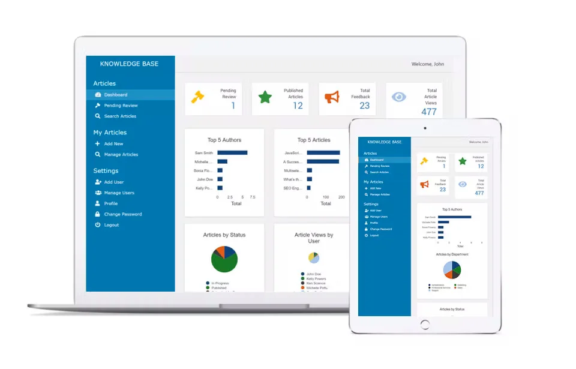

```md
# 🏥 Hospital Management System — Vue.js

Application web de gestion d’hôpital développée avec **Vue.js (Composition API)** dans un cadre pédagogique, simulant un environnement professionnel avec travail collaboratif sur GitHub.

---

## 🎯 Objectif du projet

Créer une application complète de gestion hospitalière permettant :

- l’authentification simulée par rôles
- la gestion des patients, médecins, rendez-vous et chambres
- un dashboard dynamique
- une architecture claire sans backend (LocalStorage)

Le projet met l’accent sur :

- l’architecture frontend
- la gestion d’état modulaire
- la collaboration en équipe avec GitHub
- les bonnes pratiques de développement Vue.js

---

## 👥 Équipe

| Nom | Rôle |
|---|---|
| **Caleb** | Gestionnaire de projet / Lead Developer |
| **Cédric** | Logique métier & LocalStorage |
| **Otniel** | UI / Layout / Dashboard |
| **Armel** | Formulaires & UX |

---

## 🧠 Stack Technique

- ⚡ Vue.js 3
- 🧩 Composition API
- 🧭 Vue Router
- 💾 LocalStorage (simulation backend)
- 🌿 Git & GitHub Flow

---

## 🧱 Architecture du projet

```

src/
│
├── assets/styles/
├── router/
├── layouts/
├── views/
│   ├── auth/
│   ├── admin/
│   ├── doctor/
│   ├── receptionist/
│   └── shared/
│
├── components/
│   ├── layout/
│   ├── ui/
│   ├── patients/
│   ├── doctors/
│   ├── appointments/
│   ├── rooms/
│   └── dashboard/
│
├── composables/
├── utils/
├── constants/
│
├── App.vue
└── main.js

````

---

## 🔐 Authentification & Rôles

Authentification simulée via LocalStorage.

### Rôles disponibles :

- **admin** → accès complet
- **doctor** → accès à ses patients et rendez-vous
- **receptionist** → gestion accueil et organisation

Protection des routes via Vue Router Guards.

---

## 📸 Aperçu de l’interface



---

## 🏗️ Fonctionnalités principales

### 🧑‍⚕️ Gestion des Patients
- CRUD complet
- Recherche en temps réel
- Filtrage par statut
- Détail patient
- Relation médecin et chambre

---

### 👨‍⚕️ Gestion des Médecins
- CRUD complet
- Spécialités
- Liste des patients associés

---

### 📅 Gestion des Rendez-vous
- Sélection patient / médecin
- Date & heure
- Statut
- Prévention des doubles réservations

---

### 🛏️ Gestion des Chambres
- Numéro & capacité
- Statut (occupée / libre)
- Affectation patient

---

### 📊 Dashboard Dynamique
- Total patients
- Patients hospitalisés
- Nombre de médecins
- Rendez-vous du jour

Calculs via `computed`.

---

## 🔄 Gestion des données

Chaque module possède son propre storage :

- patients
- doctors
- appointments
- rooms
- users

Relations simulées sans backend :

```js
const doctor = doctors.value.find(
  d => d.id === patient.doctorId
)
````

---

## 🌿 Workflow GitHub (Organisation Équipe)

### Branches principales

* `main` → version stable
* `develop` → intégration globale (Lead uniquement)

### Branches fonctionnalités

Convention :

```
feature/nom-fonctionnalite
```

Exemples :

```
feature/auth-system
feature/patients-crud
feature/dashboard-ui
```

---

### Processus de travail

1. Créer une branche feature
2. Développer la fonctionnalité
3. Commit clair
4. Push GitHub
5. Pull Request vers `develop`
6. Review & merge par le Lead

---

## 📦 Installation

### 1️⃣ Cloner le projet

```bash
git clone <repo-url>
```

### 2️⃣ Installer les dépendances

```bash
npm install
```

### 3️⃣ Lancer le serveur

```bash
npm run dev
```

---

## 🔑 Données de connexion (simulation)

Exemple utilisateurs :

| Role         | Email                                                   | Password |
| ------------ | ------------------------------------------------------- | -------- |
| admin        | [admin@hospital.com](mailto:admin@hospital.com)         | 1234     |
| doctor       | [doctor@hospital.com](mailto:doctor@hospital.com)       | 1234     |
| receptionist | [reception@hospital.com](mailto:reception@hospital.com) | 1234     |

---

## 🎨 Design Principles

* Interface claire et minimaliste
* Sidebar fixe
* Dashboard par cartes
* Navigation adaptée selon le rôle
* UI cohérente et professionnelle

---

## ⭐ Fonctionnalités Bonus

* Toast notifications
* Mode sombre
* Export JSON
* Bouton reset database
* Validation personnalisée
* Filtrage multi-critères

---

## 📚 Objectifs pédagogiques atteints

* Architecture Vue.js modulaire
* Composition API avancée
* Gestion d’état sans backend
* Contrôle d’accès par rôle
* Collaboration GitHub professionnelle

---

## 🚀 Perspectives d’amélioration

* Intégration API REST réelle
* Pinia pour state management global
* Tests unitaires
* Authentification JWT
* Graphiques avancés pour dashboard

---

## 📄 Licence

Projet pédagogique réalisé dans le cadre d’un apprentissage Vue.js.

---

## 🙌 Remerciements

Merci à toute l’équipe pour la collaboration et l’organisation professionnelle du projet.

```

---

## ⭐ Petit conseil (de lead à lead)

Ajoute aussi un fichier :

```

CONTRIBUTING.md

```

avec vos règles Git → ça fait **très niveau entreprise**.

---


la chambre dépend du patient 

1- la chambre sert à :
- créer une chambre avec un numéro unique (sans Date.now()) : exemple : 001, 002...
- prédéfinir la capacité d'une chambre
- prédéfinir son status (libre, occupéen maintenance)
- voir les patients qui sont affectés à ces chambres

2- le patient doit être dans une chambre sont le numéro a été effectivement créer.

Donc au niveau des chambres créer, si on attribut une chambre au patient dans Patient.view, le statut doit-être automatiquement changé en "occupé"
et la capcité doit s'ajuster pour afficher le nombre de place encore disponible